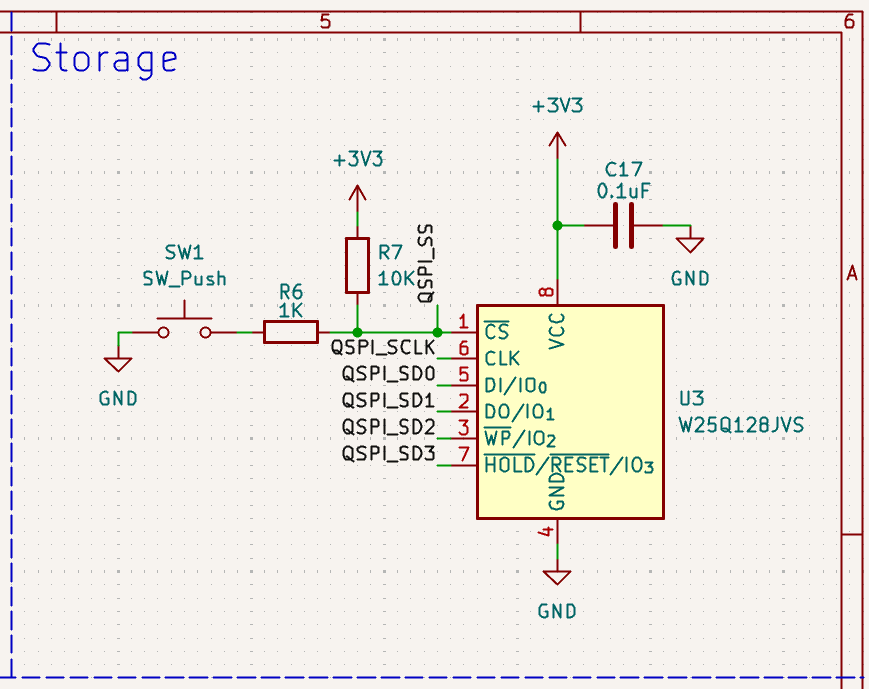
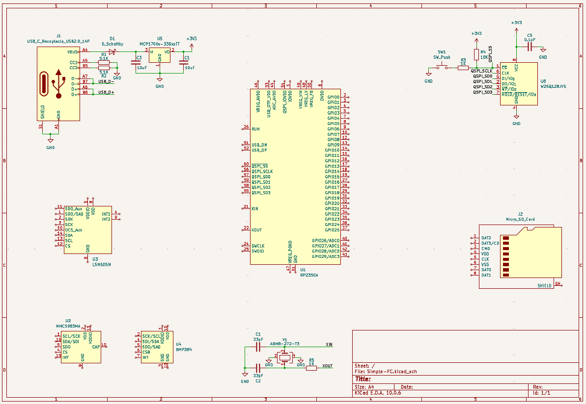
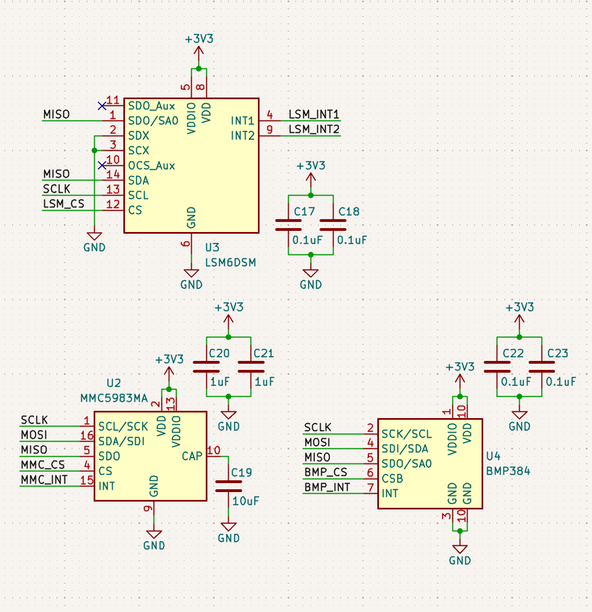
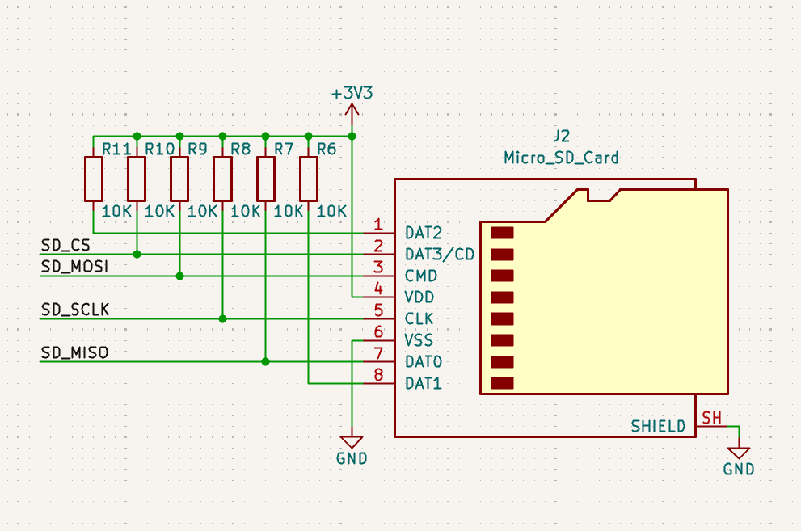
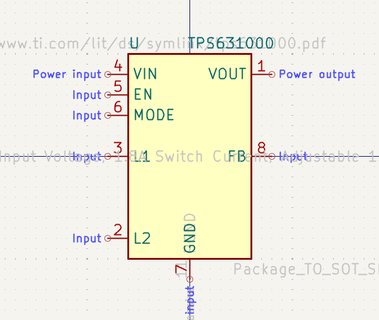
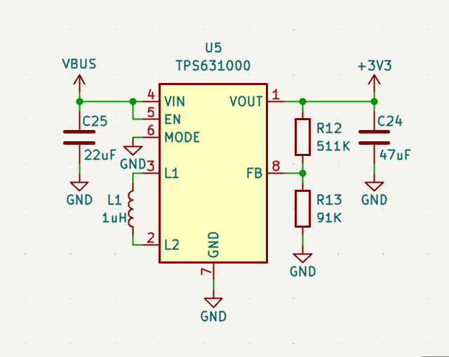
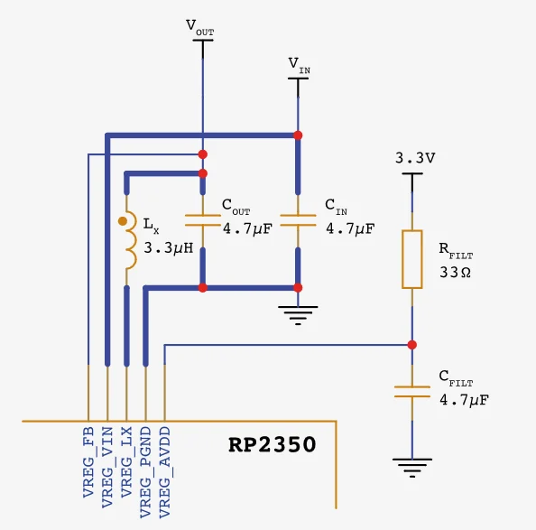
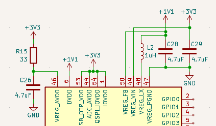
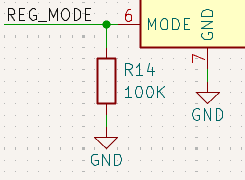

# 2026-10-07: Selected Parts

### About the project
For this board I chose to make a flight controller as it is something I'm sort of familiar with and have designed a couple in the past.  I chose to base it of the RP2350. I've been working with a RP2040 board I made recently and I kinda like it so I chose to go with the new chip in the series. There are some similarities so I copied over the usb c, power regulator, memory, and oscillator circuits of my previous design because if it ain't broke don't fix it.

### Memory
I did want to change up the memory to something cheaper, the memory IC on my other board is about $5 for 128MBits but I chose to stick with it because I know it works and I'm not very familiar with external memory in general.

### Sensors
For the IMU I chose the LSM6DSM because I've used similar sensors before. For the magnetometer and barometer I chose the MMC5983MA and BMP384 respectively because I've used them before.

### Storage
I decided to add a micro sd card for data logging. At first I wasn't sure because I'm using SPI for all the senors and I didn't know how many SPI modules the RP3250 has and if it will interrupt polling the sensors. After looking into it some more the RP3250 has two SPI modules so I decided to add one. I found a socket on digikey that kicad already has a footprint for and went with it.

**2h**

# 2026-10-07: Routed Sensors and Micro SD Card

### Sensors
I looked through the datasheets of each of the sensors and routed them up accordingly. This was pretty routine but for the magnetic sensor the datasheet called for only one 1uF cap for both power pins but I decided to add one for each power pin.

### Micro SD Card
I wasn't sure how to wire up the micro sd card at first since the rp2350 can only communicate with it with spi. I found the pinout for it and added 10k pullup resistors for each pin. I didn't need a logic shifter as the mcu and the card both use 3.3v.

### 2026-10-08: Switched to Buck-Boost Regulator

**1h**

# Switched to Buck-Boost Regulator

### Why the switch
I was thinking more about how this would work with other boards and I decided it needs a wider input voltage range and a higher output current so it can power other boards as well. So I went looking for a buck-boost regulator and found the TPS631000.

### Changes to the schematic
Kicad didn't have the symbol for the TPS631000 so I copied the symbol for the TPS63000 and made the changes myself.

The example schematic already had the requirements I needed so I pretty much copied that and called it a day.

**1h**

# 2026-10-08: Made MCU Power Circuit

I went to start routing up the RP2350 and started with the power circuit. After reading the datasheet I was a little confused but I started trying to recreate the example power circuit for the build in 1.1v regulator it needs.

The default kicad symbol was making it confusing so I changed it to be closer to the datasheet.

I also changed the regulator circuit to a pull down resistor so it defaults to low power mode but can be toggled with a gpio.

**1h**

